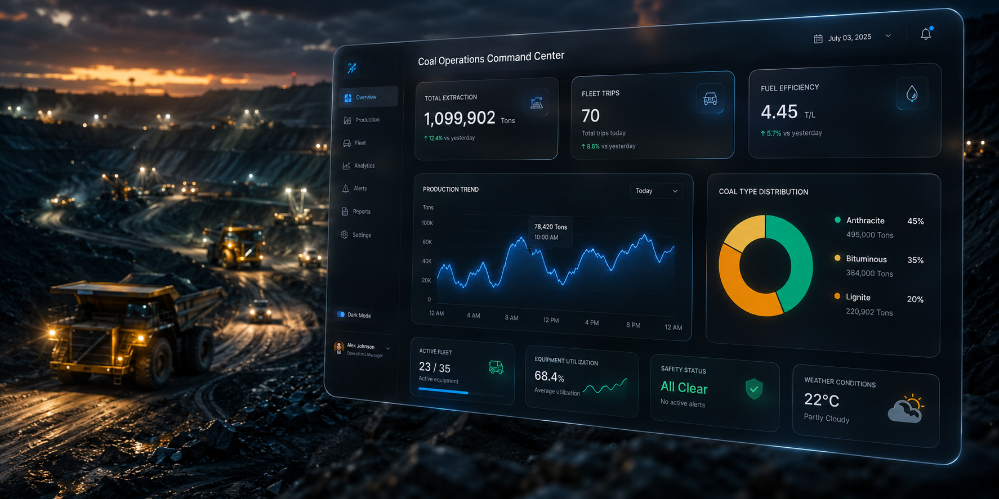
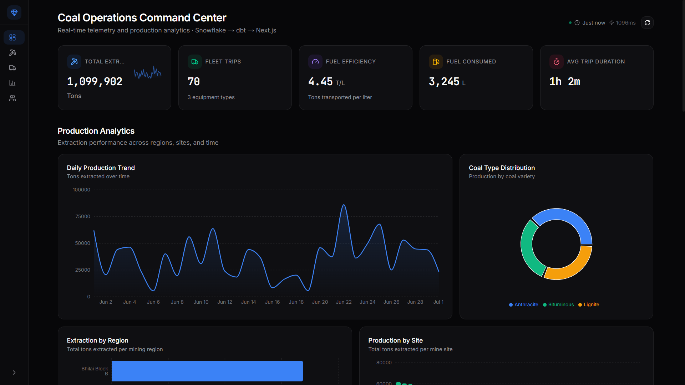
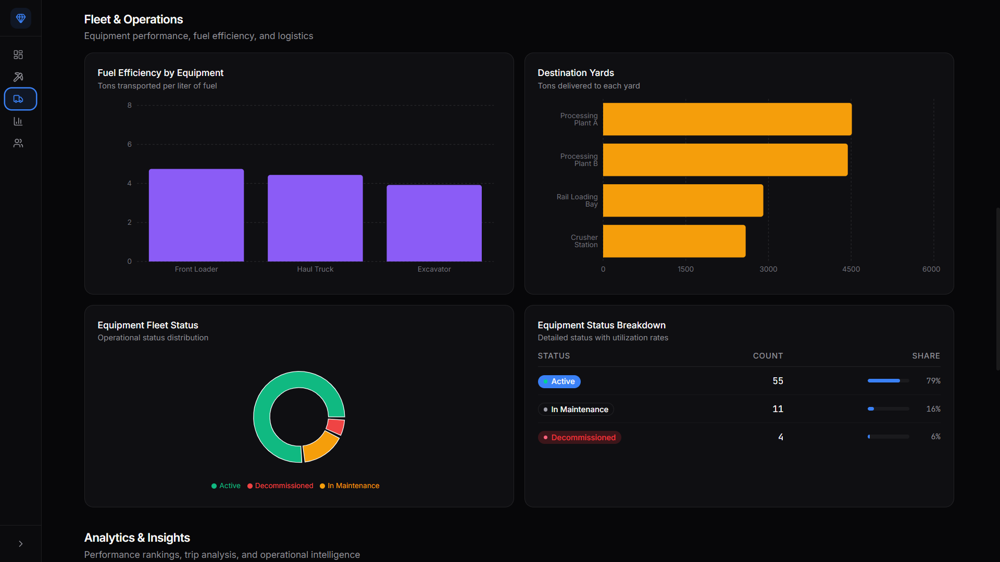
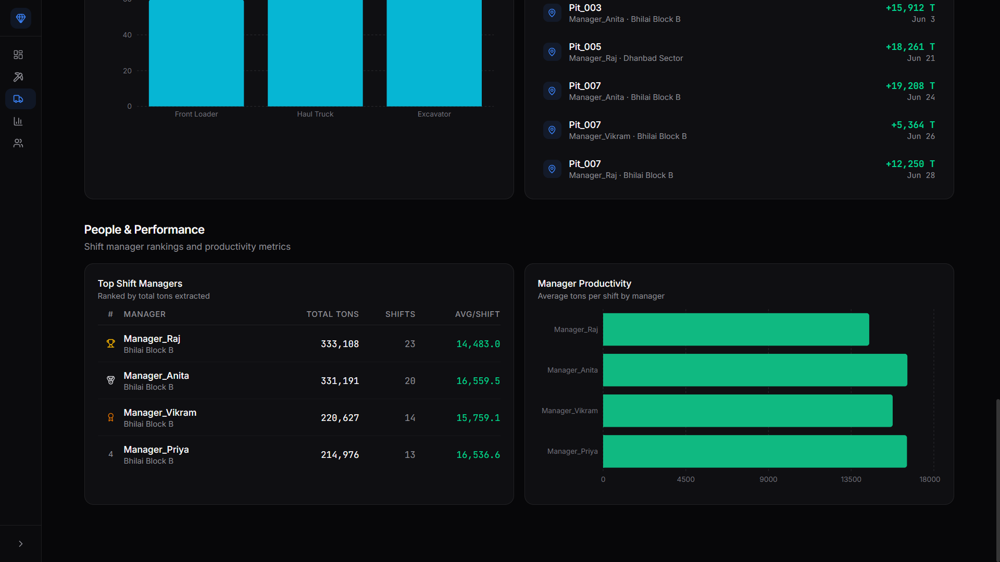

<div align="center">
  <!-- 
    REPLACE THIS IMAGE WITH YOUR BANNER OR HERO SCREENSHOT 
    Recommended size: 1200x600px
  -->
  

  # ⛏️ Coal Operations Command Center
  
  **Real-Time Data Pipeline & Telemetry Dashboard for Mining Operations**

  <p align="center">
    
    
    
    
    
  </p>
</div>

---

## 📖 About The Project

This project was developed during my internship at **Accenture**. It is an end-to-end data pipeline and real-time telemetry dashboard designed to monitor and optimize coal mining operations. 

Modern mining relies heavily on heavy machinery and logistics. A minor inefficiency in fleet haulage or equipment downtime can cost thousands of dollars per hour. This platform bridges the gap between raw machine telemetry and actionable business intelligence.

By aggregating data from extraction sites and hauling fleets into a centralized Snowflake data warehouse, and transforming it via dbt, this Next.js dashboard provides Shift Managers with instantaneous visibility into **fuel efficiency, total extraction yields, and equipment status**.

### ✨ Technical Capabilities & Skills
- **Data Engineering**: Architected an ELT pipeline moving raw S3 data into a Snowflake warehouse, writing custom `dbt` models to build fact and dimension tables.
- **Frontend Engineering**: Built a responsive, highly-interactive SPA using Next.js, React 19, and Tailwind CSS.
- **UI/UX Design**: Implemented a modern, glassmorphic design system using `oklch` color spaces, Framer Motion animations, and custom Recharts visualizations.
- **System Architecture**: Designed a decoupled architecture separating the raw data ingestion from the business analytics layer.

---

## 📸 Dashboard Previews

> **Note:** Create a `docs/images/` folder and drop your screenshots there, then update these links!

<div align="center">
  <!-- Dashboard Overview Screenshot -->
  
  <p><i>Main Dashboard Interface: Real-time KPIs and Production Trends</i></p>
</div>

<br />

| Fleet Analytics | Dark Mode UI Elements |
| :---: | :---: |
| <!-- Add Fleet Image --> | <!-- Add UI Image --> |
| *Monitoring equipment status and fuel consumption across regions.* | *Custom designed React components using Tailwind CSS and Radix UI primitives.* |

---

## 🏗️ System Architecture

<!-- 
  REPLACE THIS WITH AN ARCHITECTURE DIAGRAM 
  You can draw one on draw.io or excalidraw and export it to docs/images/
-->
<div align="center">
  
</div>

1. **Ingestion (AWS S3)**: Raw telemetry logs (JSON/CSV) from mining equipment are uploaded to secure S3 buckets.
2. **Storage (Snowflake)**: External stages are configured in Snowflake to ingest the raw S3 data into staging tables.
3. **Transformation (dbt)**: `dbt` (Data Build Tool) is used to clean, join, and aggregate the raw data into business-ready Fact (`FCT_DAILY_PRODUCTION`) and Dimension (`DIM_EQUIPMENT`) tables.
4. **API Layer (Next.js)**: Next.js API routes query the transformed Snowflake views securely using the Snowflake Node.js SDK.
5. **Presentation (React)**: The client-side dashboard fetches the data, performs final formatting, and renders it through interactive Recharts.

---

## 🚀 Getting Started

To run this project locally, you will need to set up both the data warehouse and the frontend application.

### 1. Snowflake & Database Setup
1. Create a Snowflake trial account.
2. Run the initialization scripts found in `snowflake/01_setup.sql` to configure the warehouse, roles, and S3 integration.
3. Run `snowflake/02_load_data.sql` to populate the raw tables.

### 2. dbt Transformation
1. Navigate to the `coal_mine_pipeline` directory.
2. Ensure you have `dbt-snowflake` installed (`pip install dbt-snowflake`).
3. Configure your `profiles.yml` with your Snowflake credentials.
4. Run the models:
   ```bash
   dbt run
   ```

### 3. Frontend Setup
1. Navigate to the `react-dashboard` directory.
2. Install dependencies:
   ```bash
   npm install
   ```
3. Copy the environment template and fill in your Snowflake credentials:
   ```bash
   cp .env.example .env.local
   ```
4. Start the development server:
   ```bash
   npm run dev
   ```
5. Open [http://localhost:3000](http://localhost:3000) in your browser.

---

## 🛠️ Built With

* [Next.js](https://nextjs.org/) - React Framework
* [Snowflake](https://www.snowflake.com/) - Cloud Data Platform
* [dbt](https://www.getdbt.com/) - Data Transformation
* [Tailwind CSS](https://tailwindcss.com/) - Utility-first CSS framework
* [Framer Motion](https://www.framer.com/motion/) - Animation Library
* [Recharts](https://recharts.org/) - Charting Library
* [Lucide Icons](https://lucide.dev/) - Iconography

---

<div align="center">
  <p>Built with ❤️ by Sanskar during the Accenture Internship Program.</p>
</div>
